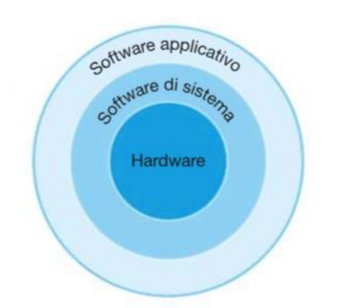

 > *Lezione del 16/09/2024*

 > **Calcolatore elettronico (o elaboratore)**
 > **Calcolatore quantistico**
 > **Cervello**

Questi sono i tre grandi calcolatori presenti all'interno della vita umana. Conoscere l'architettura dei calcolatori ci permette di capire cosa c'è all'interno di ciò che utilizziamo, così da poterlo utilizzare al meglio e in un futuro poterli anche migliorare.
Un calcolatore elettronico è definito come **un sistema digitale di elaborazione dell'informazione, programmabile e general-purpose**. 
- **Sistema:** è un qualsiasi oggetto di studio che, pur essendo costituito da diversi elementi interconnessi e interagenti tra di loro o l'ambiente esterno, reagisce o evolve come un elemento unitario con proprie leggi generali. Ogni sistema ha una sua organizzazione e struttura: **architettura**.

## Descrizione di un sistema
Abbiamo tre modi per descrivere un sistema:
- **funzionale (behavioural):** descrizione dell'input, dell'output e delle funzioni del sistema e della relazione presente tra ingresso ed uscita
- **strutturale (architetturale):** descrive com'è fatto il sistema in termini di elementi primitivi che lo compongono e della loro organizzazione
- **descrizione fisica o implementazione:** descrive l'effettiva realizzazione dell'istanza, indicando i componenti impiegati e le loro interconnessioni
Quando si parla di livelli di astrazione significa utilizzare tutti i dettagli utili per comprenderne in dettaglio funzionamento o struttura ad uno specifico livello di studio, ignorando quelli superiori o inferiori, e definendo interfacce per passare a queste ultime.

## Analisi e sintesi
- **Analisi:** processo che ci permette di partire dalla descrizione strutturale di un sistema per crearne la descrizione funzionale
- **Sintesi:** progettazione vera e propria; a partire da una descrizione funzionale andiamo a progettare e simulare il sistema, fino ad arrivare alla descrizione strutturale
**IMPORTANTE:** l'analisi è univoca, mentre la sintesi no. Vengono infatti considerate nella sintesi un sacco di variabili che portano a diversi tipi di progettazione.
Progettare un calcolatore significa *modellare e ottenere la sintesi dei suoi componenti e delle interconnessioni tra i componenti (hardware e software) per ottenere una specifica funzionalità*.

## Concetto di architettura dei calcolatori
Dipende dal livello di astrazione a cui ci si pone, ma in generale l'architettura dei calcolatori è ***il modello che, data la descrizione funzionale ad uno specifico livello di astrazione, ne definisce la struttura e la organizzazione delle parti***. Il livello di astrazione dell'architettura dei calcolatori è quello del programmatore di basso livello (o ancora meglio, del compilatore), lavorando solitamente in _assembly_.

Un sistema di elaborazione ha quindi una propria descrizione funzionale: ***un calcolatore è un sistema digitale di elaborazione capace di interpretare ed eseguire programmi (sequenze di istruzioni) memorizzati, elaborare***
E' un sistema digitale che dal punto di vista funzionale quindi fa quattro cose:
- deve saper gestire delle istruzioni (in quanto è programmabile), come interpretare, memorizzare, recuperare, controllare, lavorare sui dati ecc.;
- elaborare dei dati: i dati binari vengono elaborati dalla ALU e da alcune altre unità (unità floating point) 
- operazioni di memorizzazione (load and store)
- operazioni di trasferimento dei dati (input/output)

**Schema funzionale di un calcolatore**


Il calcolatore, dal punto di vista di una descrizione strutturale, è un insieme composto da tre elementi:
- un'unità di elaborazione dei dati (_datapath_) e unità di controllo, costituenti il **processore (o CPU, Central Processing Unit)**
- una memoria
- un'unità di input e un'unità di output 
Vi è inoltre una parte che collega le tre parti, costituita da una o più _bus_.
Tuttavia il calcolatore, aldilà di una struttura hardware, è composta anche di una struttura software, senza la quale non funzionerebbe, divisa in software **di base** e **applicativo**. Dal punto di vista logico, hardware e software sono equivalenti, a secondo del livello di astrazione a cui ci poniamo.

**Schema strutturale di un calcolatore**

## Livelli di astrazione
Sia l'hardware che i software hanno dei livelli.
- Parte Software, dal più superficiale:
	- Software applicativo
	- Software di sistema
	- Software di base e hardware
- Parte Hardware, dal meno superficiale:
	- Livello dei circuiti
	- Livello delle reti logiche
	- Livello RTL (*register transfer level*)
	- Livello di sistema

**Livelli di astrazione software**

**Livelli di astrazione hardware**


## Hardware Description Language
I linguaggi HDL (_hardware description language_) ci permettono di descrivere, in modo sia funzionale che architetturale, un sistema anche a livello di RTL (principalmente VHDL e Verilog). Esiste anche il SystemC, utilizzato a livello di sistema soprattutto per modelli a livello transazionale e comportamentale. Tale linguaggio verifica sia dal punto di vista sintattico che dal punto di vista simulativo quello che viene descritto, passando così da codice a sistemi a livello RTL e poi ad ASIC e FPGA (_field programmable gate arrays_, circuiti elettronici già pronti con all'interno matrici elementari di gate che permettono la programmazione).
Tali linguaggi ci permettono quindi di passare da un livello di astrazione all'altro.

## Livelli tra hardware e software per il calcolatore
- **Livello di mircro-architettura:** è il livello più importante, in quanto definisce come viene fatta, a livello di blocchi logici, una CPU. E' descritto come RTL o come sistema.
L'RTL è un linguaggio formale che ci permette di capire quali operazioni sta eseguendo la nostra CPU:

**Esempio di RTL nella microarchitettura**

1. Operazione di scrittura in memoria
2. Operazione di scrittura in un registro interno

 > **Altro esempio**: assegnamento di un valore alla variabile var1
```
MDR <- 5
MAR <- var1
M[MAR] <- MDR
```

- **Livello Instruction Set Architecture (ISA) o livello di linguaggio macchina:** è il livello che definisce l'architettura delle CPU e, di conseguenza, ciò che il compilatore può svolgere. Ogni produttore ha un manuale della CPU e del proprio linguaggio macchina implementato nell'ISA. 

**Linguaggio macchina per una somma in C**

## Dati digitali
- **Dati:** elementi impiegati per produrre un lavoro o compito determinato (numeri, lettere, valori grafici, audio, video)
- **Segnali:** rappresentazioni fisiche che possono essere trasformate in digitali tramite convertitori
I dati quindi possono essere digitali di per sé oppure trasformati in digitali. Attualmente si parla anche di dati _multimediali_ (diversi mezzi di fruizione dei dati) o _multimodali_ (dati rappresentati in diversi modi)
I segnali analogici assumono un infinito di valori all'interno di un dato intervallo, mentre quelli digitali assumono un numero finito di valori. I segnali diventano per noi dati multimodali e multimediali. Un segnale si dice _binario_ se può assumere solo due valori e si dice **bit**. Le variabili binarie sono variabili definite da configurazioni binarie di n bit, ossia stringhe di n cifre binarie 1  e 0. Una configurazione a 8 bit si dice **byte**.

## Esempi di codifiche


## Unità di misura


 > **Instruction Set Architecture**
 > - quali istruzioni
 > - formato dei dati
 > - registri ortogonali e non ortogonali
 > **Microarchitettura**: come viene implementato di fatto l'instruction set architecture
 > Anche se un processore Intel è oggettivamente diverso da AMD come ISA, possono avere comunque la stessa microarchitettura. 
 
---
 > *Lezione del 18/09/2024*

## Informazione
Nel mondo informatico non si parla di dati, bensì di **informazione**. Il concetto di *misurare l'informazione*, ai tempi, significava misurare quante risorse servivano per mandare tale informazione stessa.
Si chiamano quindi informazioni **dati che assumono un significato univoco**, utile per una specifica applicazione.
Alla base della *teoria dell'informazione*, secondo Shannon, ***l'informazione viene in base alla quantità di incertezza che riesce a togliere.*** Il bit, inventato da quest'ultimo, diventa l'elemento atomico dell'informazione.
Shannon fece delle considerazioni *asemantiche*, ossia indipendenti dal significato di ciò che viene trasmesso nel messaggio, e introduce lo stesso concetto per l'entropia in fisica (disordine in un sistema fisico misurata in J/K) nell'informatica.

**Informazione di un generico simbolo Xi**
$$
I(x_i) = Log_B\frac{1}{P\left(x_{i}\right)}
$$
L'informazione connessa ad un simbolo binario è:$$I\left(x_{i}\right)=-\log_2\left(P\left(x_{i}\right)\right)$$Più un simbolo è probabile, meno informazioni porta:
$$P\left(x_{i}\right)>P\left(x_{j}\right) \leftrightarrow I\left(x_{i}\right)<I\left(x_{j}\right)$$
Viene studiata per capire come comprimere i messaggi per non perdere l'informazione.
Il contenuto informativo medio di una sorgente si può misurare come **entropia** se si considera il valore medio su tutto l'alafabeto dei simboli possibili:
$$H\left(X\right)=\sum_{i=1}^n P\left(x_{i}\right)\log_{B}\frac{1}{P\left(x_{i}\right)}$$
E' quindi la media ponderata dell'informazione di ogni simbolo, è sempre positiva o uguale a zero ed è misurata in Bit.
Da tale formula è possibile dire che l'informazione trasmessa, e quindi l'entropia, di un solo simbolo binario è **1bit**.

Tutto questo serve per dire che il calcolatore elettronico ha la necessità di rappresentare l'informazione nel modo più compatto possibile, e per noi l'informazione è considerata come **dato il cui contenuto può ridurre l'incertezza sui simboli impiegati e rappresentabile in modo discreto**.
## General-purpose
Esistono tre tipi di sistemi general-purpose:
- sistemi general-purpose programmabili
- sistemi embedded
- sistemi ASIC
I primi sono delle macchine la cui funzione viene specificata dal software, hanno almeno una CPU e almeno un sistema operativo. A differenza di questo, i secondi, detti anche sistemi dedicati, sono sì sistemi digitali programmabili, ma la loro funzione è specificata in parte dal software e in parte dall'hardware. Anche tali sistemi hanno generalmente una CPU, specializzata internamente, mentre il sistema operativo può esserci, non esserci, o essere molto semplificato.
 > **Esempi di sistemi embedded:** GoPro, mouse, sistemi digitali all'interno di un auto
 
Gli ultimi, i sistemi ASIC (_application specific integrated circuit_) sono sistemi di elaborazione che possono avere un'assenza di CPU, e non sono programmabili dal software ma solo configurabili (possibilità di indicare da parte dell'utente un insieme di ingressi per modificare o selezionare la funzionalità interna in base ad un programma o ad una rete logica già definita).

Tale divisione tra sistemi non è una divisione netta, ma è possibile incontrare anche sistemi "nel mezzo".