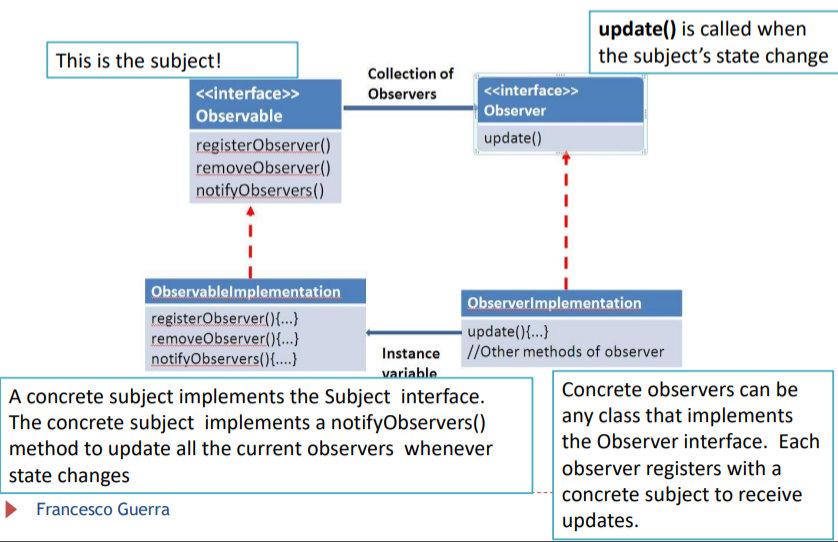
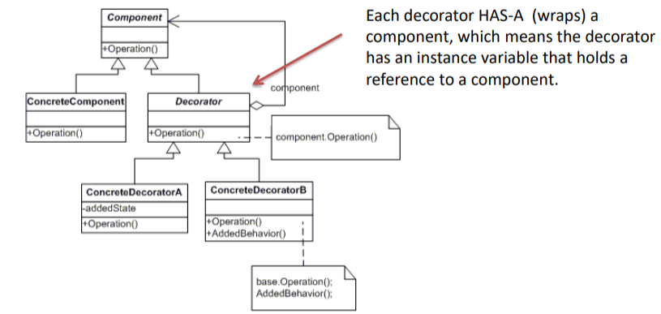

 > *Laboratorio 27/09/2024*

Prima di parlare di design pattern, andiamo a definire i principi della programmazione ad oggetti:
1. **ereditarietà**: necessita di specificare una specializzazione, una relazione, una gerarchia  presente anche in una situazione reale
2. **incapsulamento**: ogni oggetto non sempre è completamente accessibile dagli oggetti esterni. Ci si può interfacciare a quest'ultima con interfacce, oppure solo internamente all'oggetto
3. **polimorfismo**: possibilità di poter far comportare funzioni e oggetti in base ad interazioni da noi definite. Ne esistono di tre tipi:
	- Ad-hoc o **method overloading**: un metodo può essere ripetuto tante volte nella classe a patto che abbia una definizione diversa (in input accetta solo interi, e dopo accetta un intero e una stringa)
	- **overriding**: il metodo nella superclasse funziona in un modo, viene specificato nella sottoclasse, e viene fatto funzionare in maniera diversa
	- **parametric**: alcune classi si comportano in un modo o in un altro in base all'oggetto
L'ereditarietà è un modo di legare diverse classi, ma è qualcosa che va limitato quanto più possibile in quanto limita e può creare degli errori (le sottoclassi si devono comportare come le superclassi, altrimenti il software non funziona).
Un altro modo di collegare due classi è la **composizione**, ossia il poter utilizzare una classe come attributo di un'altra. E' un collegamento molto meno forte, e permette di mantenere la manutenibilità nel tempo.

Conoscere tali principi della programmazione ad oggetti non è ovviamente abbastanza per essere un buon designer, in quanto un design pensa a come creare un design flessibile, mantenibile nel tempo e che si adatta facilmente ai cambiamenti. I **design patterns** permettono di:
- provvedere un set di soluzioni a problemi di design comuni
- provvedere un vocabolario per comunicare tra programmatori e sviluppatori
- non commettere degli errori, essendo *best practice*
Sono astrazioni di problemi concreti e ricorrenti, a cui si forniscono delle soluzioni. Solitamente vengono descritti attraverso una sorta di schedina. I pattern si dividono per scopo:
- **creazionali**: servono per costruire nuovi oggetti:
	- Abstract factory
	- Builder
	- Prototype (non visto)
	- Singleton
- **strutturale**: ci permette di rappresentare in maniera migliore e più efficiente la realtà che sto cercando di rappresentare
- **comportamentali**: modificano il comportamento del software in tempo di esecuzione
I design patterns possono basarsi sull'ereditarietà (**class**) e sulla composizione (**object**).

 > Data una gerarchia, andiamo a riscrivere i metodi nelle classi figlie solo se sto facendo un'override di una classe padre.
## Design principles
1. **Identifica gli aspetti del tuo software che potrebbero cambiare e separable da ciò che rimane fermo**. Questo perché gli errori possono essere generate solo da ciò che cambia.
2. **Devo sempre cercare di creare un interfaccia, un'astrazione, non un implementazione**. Progettare qualcosa di generico ci permette di specializzarlo attraverso il polimorfismo.
3. **Occorre favorire la composizione rispetto all'eredità**.
---
 > *Laboratorio 04/10/2024*
## Observer
Come lo strategy, è una tecnica **comportamentale**. Prende le cose che cambiano in una classe e le porta fuori. Definisce una dipendenza uno a molti tra degli oggetti in maniera tale che se uno degli oggetti cambia stato, tutti gli elementi ad esso dipendenti sono notificati e aggiornati in maniera automatica. Viene implementato attraverso due interfacce che vengono in qualche modo estese. Permette pochissimo accoppiamento tra gli elementi.

 > **Tecnica push**: tecnica per ottenere i dati che vogliamo. Predilige lo sdoppiamento massimo, tuttavia permette una poca flessibilità del codice.
 > **Tecnica pull**: costringiamo l'observer a conoscere l'interno degli observable, così che se cambia uno dovrà cambiare obbligatoriamente anche l'altro. L'observer ottiene i dati incapsulati in un oggetto.

## Decorator
E' un design pattern che permette di aggiungere e modificare funzionalità di una classe senza modificarla internamente. 
Il decorator è fortemente utilizzato, tant'è che viene utilizzato anche nell'API di Java.

---
 > *Laboratorio del 11/10/2024*
## Factory
I factory servono essenzialmente per creare dei nuovi oggetti. Utilizzare new nelle classe infatti può diventare problematico (ad esempio, fare il new di tutte le classi presenti all'interno di una classe  dove c'è dell'altro codice, richiede una modifica ogni volta che viene creata una nuova classe, non rispettando l'**open closed principle** (vedi [08. Design del software](08.%20Design%20del%20software.md) )).
Per ovviare a questi problemi quindi gli oggetti si affideranno ad un'oggetto Factory, il quale farà da tramite per la creazione degli ulteriori oggetti. In questo modo, tutte le modifiche da fare sono incapsulate in una sola classe.

- Tenendo il `SimplePizzaFactory` public, garantiamo l'estensione della classe, cosa non garantita nel momento in cui usiamo static. Dovremo però ricordarci, nel caso in cui lo rendiamo pubblico, di creare un oggetto `SimplePizzaFactory` nel main. Solitamente, tra i due questo è il metodo che viene preferito
Questo va bene nel momento in cui abbiamo bisogno di un solo Factory. Nel momento in cui il numero di Factory richiesti aumenta, si procederà con la creazione di un Factory astratto che verrò esteso da tutte le classi che lo richiedono (**Abstract Factory**).


---
 > *Laboratorio del 18/10/2024*
## Builder
Anche il builder è una tecnica utilizzata per creare degli oggetti, in particolare quando un oggetto deve essere creato attraverso diversi Factory.


## Singleton
Quando vogliamo garantire che una classe abbia una sola istanza che rappresenti un qualcosa, si utilizza il **singleton pattern**. E' uno dei pattern più semplici, gestito in questo modo:
```
public class Singleton { 
	private static Singleton uniqueInstance;
	
	// other useful instance variables here
	
	private Singleton() {}
	public static Singleton getInstance() {
		if (uniqueInstance == null) { 
			uniqueInstance = new Singleton(); 
		} 
		return uniqueInstance; 
	}
	// other useful methods here 
}
```
Tale implementazione però può avere dei problemi nel momento in cui abbiamo un'applicazione multithread. Possiamo risolvere tale problema aggiungendo la parola chiave `synchronized` al metodo `getInstance()`, anche se questo rallenta sicuramente le performance del sistema.
Un altro modo quindi per risolvere tale problema del multithreading è istanziare direttamente la un oggetto della classe quando la classe stessa viene caricata:
```
public class Singleton { 
	private static Singleton uniqueInstance = new Singleton();

	private Singleton() {}
	public static Singleton getInstance() {
		return uniqueInstance; 
	}
}
```
La seconda soluzione è invece un "double-check" per ridurre il numero di sincronizzazioni:
```
public class Singleton { 
	private volatile static Singleton uniqueInstance;
	
	private Singleton() {}
	public static Singleton getInstance() {
		if (uniqueInstance == null) { 
			synchronized(Singleton.class){
				if(uniqueInstance == null){
					uniqueInstance = new Singleton();
				}
			}
		} 
		return uniqueInstance; 
	}
}
```
Un'ultima implementazione del Singleton può essere fatta attraverso una classe `enum`:
```
public enum SingletonEnum{
	INSTANCE;
	int value;
	
	public int getValue(){
		return value;
	}

	public void setValue(int value){
		this.value = value;
	}
}
```
- l'`enum` serve per indicare delle categorie. Essendo presente una sola categoria all'interno dell'`enum`, allora è garantita da Java l'unicità dell'istanza
Nel 99% dei casi, tuttavia, il primo metodo funziona.
## Command
Il command pattern ci permette di incapsulare l'invocazione di un metodo nell'esecuzione del metodo stesso. Creiamo quindi due attori: uno che esegue il metodo e uno che lo chiama:
- Il cliente (command) crea un comando, un'oggetto col metodo "esegui"
- ogni comando verrà associato all'invoker, il quale utilizzerà effettivamente il metodo "esegui" per il quale l'esecuzione del comando viene effettivamente realizzata
Questo tipo di pattern viene utilizzato per gestire, ad esempio, una coda di comandi.
E' possibile anche che il comando abbia un metodo `undo()`.

