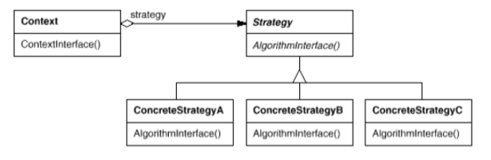

 > *Lezione del 02/10/2024*

Ogni software ha una **struttura** e un **comportamento**, ossia com'è fatto e cosa fa. A noi importa che il software funzioni, ed è qualcosa di interesse sia dei progettisti sia del cliente. Il software inoltre deve essere "soft", modificabile. Quindi si ha bisogno di una struttura del software che sia modificabile, per l'appunto .
Normalmente, all'inizio dello sviluppo è facile fare modifiche alla struttura, ma se arriviamo alla fine della progettazione che le modifiche non possono essere effettuate in maniera veloce, non abbiamo creato un software efficiente.
**L'obiettivo dell'architettura software è minimizzare le risorse umane richieste per costruire e mantenere il sistema**.
## Design
Anche il design può essere diviso in due livelli:
- **architettura di alto livello**: come sono coinvolte e concepite le classi (design dell'architettura)
- **architettura di basso livello**: comportamento specifico di ogni singolo componente (design del dettaglio)
Un'analisi del dettaglio molto accurata permette di avere un'implementazione relativamente immediata.
I principi che regolano il design vengono chiamati **principi SOLID**.
SOLID è un acronimo che sta per:
- ***Single Responsibility Principle (SRP)***: ogni classe deve avere una sola ragione per cambiare
	- Una **responsabilità singola** è un motivo di cambiamento. Il cambiamento è generato dall'utente utilizzatore, quindi ogni modulo **deve essere collegata ad un solo attore** (un modulo è un qualsiasi file sorgente, quindi può essere una classe come un pacchetto). Se una classe ha più ragioni per cambiare, allora cambierà più frequentemente e produce degli errori. Per evitare dipendenze di una classe da più attori, è possibile ad esempio utilizzare il ***façade design pattern***.
[ aggiungi foto esempio facade ]
- ***Open Closed Principle (OCP)***: non bisogna modificare una classe, ma solo estenderla. Una volta creato un metodo, non possiamo più modificarlo.
	- il design pattern che consente di cambiare i comportamenti è lo ***strategy***, per il quale si aggiunge un'interfaccia astratta implementata da diverse classi. Ogni blocco si gestisce da solo e si rapporta al resto dell'applicazione con delle interfacce.

- bisogna dipendere solo da cose necessarie
- bisogna dipendere da astrazioni e non elementi concreti
---
 > *Lezione del 09/10/2024*

Il software viene quindi generato con una sorta di gerarchia a livelli, nella quale vogliamo che solo i livelli più bassi possano cambiare, mentre la parte più alta no, in quanto la parte più bassa dipende da quest'ultima.
Nell'***open closed principle*** ci sono le seguenti regole:
- non usare mai variabili globali
- tutte le variabili di un membro devono essere private
- l'identificazione del tipo in runtime è pericoloso

- ***Liskov Substitution Principle***: Bisogna strutturare le gerarchie pensando al comportamento dei membri che ne fanno parte. Tutte le sottoclassi devono comportarti some le superclassi
- ***Interface Segregation Principle***: Una classe non deve dipendere da interfacce che non vengono utilizzate dalla stessa
- ***Dependency Inversion Principle***: moduli di alto livello e moduli di basso livello devono dipendere da astrazioni. Ovviamente, quelli di alto livello contengono la logica del programma, mentre quelli di basso quelli che si interfacciano verso l'esterno e l'utente.
  Tale tipo di principio viene risolto attraverso l'utilizzo dei ***factory*** (vedi [07. Design Pattern](07.%20Design%20Pattern.md)), che ci permette di avere le seguenti attenzioni:
	  - non far riferire una variabile ad una classe concreta
	  - nessuna classe dovrebbe derivare da una classe concreta
	  - nessun metodo dovrebbe riscrivere un metodo implementato in un metodo delle sue classi base
#### Astrazioni stabili
- cambiare un interfaccia astratta corrisponde a cambiare la sua implementazione concreta
- non bisogna estendere classi concrete. L'estensione, generalmente, va fatta su astrazioni
- non bisogna sovrascrivere classi concrete
#### Factory
Ogni factory è un'interfaccia che permette di istanziare classi concrete all'interno dei nostri software.

---
 > *Lezione del 10/10/2024*
## Principi di coesione
- ***Principio di riuso/rilascio**:* all'interno dello stesso pacchetto vanno inseriti componenti che vengono sviluppati insieme e vengono rilasciati nello stesso momento
- ***Common closure principle***: nello stesso pacchetto vanno inseriti classi che cambiano per gli stessi motivi e nello stesso momento (Single Responsibility Principle per i componenti)
- ***Common reuse principle***: non forzare gli utenti di un componente a dipendere da cose di cui non ne hanno bisogno
CCP e REP tendono a creare dei pacchetti molto grandi (principi inclusivi), mentre il CRP tende a fare componenti più piccoli (principio esclusivo). 
Lavoriamo con questo tipi di principi attraverso altri tre principi:
- ***Principio di dipendenza aciclica (ADP)***: nel grafo delle dipendenze tra i componenti non devono esserci cicli.
  L'assenza di cicli permette di sviluppare ogni componente in maniera indipendente, a patto che stabiliamo delle interfacce che ci permettono di comunicare tra componenti.
  Un cambiamento in un pacchetto si propaga solo "verso i pacchetti precedenti". Per evitare che si propaghi a troppi componenti, si procede con il successivo principio.
  I cicli possono essere eliminati attraverso l'introduzione di un'interfaccia oppure di una classe.
- ***Principio di dipendenze stabili (SDP)***: un pacchetto deve dipendere da qualcosa che sia più stabile del pacchetto di provenienza, in maniera tale che questo debba cambiare il meno possibile. La stabilità è legata al numero di componenti di dipendenze in entrata (più ne sono, più deve essere un componente stabile). La metrica utilizzata per la stabilità è l'**instabilità** (0 deve essere stabile, 1 può essere instabile) e si calcola come $\frac{fan_{out}}{fan_{in}+fan_{out}}$, dove $fan_{out}$ sono le dipendenze in uscita, mentre $fan_{in}$ le dipendenze in ingresso. 
- ***Stable abstraction principle (SAP)***: interfacce e classi astratte dividono ciò che deve rimanere fisso da ciò che cambia, implementato in estensioni concrete delle astrazioni stesse. Un componente quindi deve essere tanto più astratto quanto più è stabile.
  La misura dell'astrazione di un componente è dato da una percentuale, ottenuta attraverso la seguente divisione: $$A=\frac{N_{A}}{N_{C}}$$
  Dove $N_A$ è il numero delle classi astratte e interfacce del componente, mentre $N_C$ il numero delle classi concrete. Ovviamente, $A$ varia da 0 a 1. 0 indica che il componente non ha classi astratte, mentre se è 1 significa che il componente è del tutto astratto.
Prese la misura di instabilità e di astrazione, è possibile descrivere un pacchetto attraverso il seguente schema:
 
E' possibile in questo modo capire quanto di qualità sia il nostro software. Più un pacchetto contenuto in quest'ultimo è vicino alla linea di mezzo, meno questo deve essere cambiato e può rimanere così com'è.