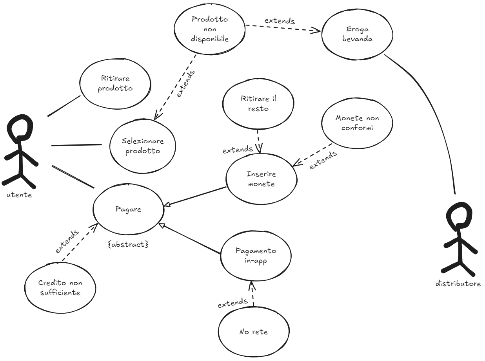
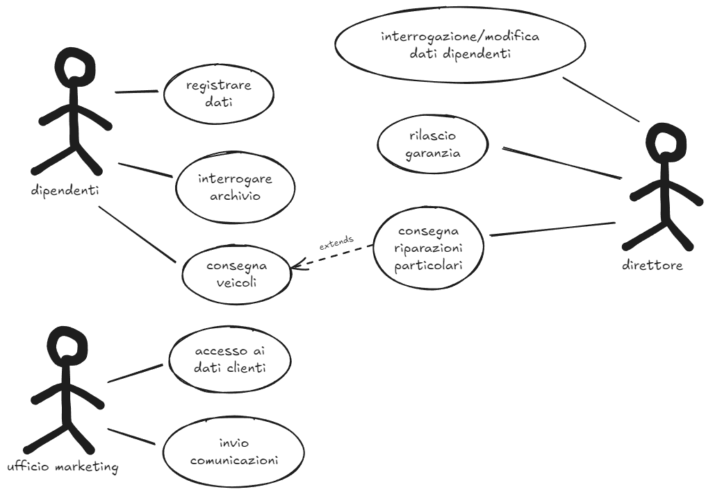

 > Si descriva in forma testuale e con il corrispondente formalismo grafico il processo si acquisto di una bevanda dal distributore automatico. L'utente può decidere di pagare utilizzando monete o utilizzando una app
 
Soluzione:

 > I dipendenti di una officina hanno il computo di registrare i dati dei veicoli in ingresso, incluso i dati dei proprietari dei veicoli, di interrogare l'archivio delle riparazioni da effettuare e di consegnare i veicoli riparati ai clienti
 > In caso di riparazioni particolarmente complesse, la consegna viene fatta dai direttori che rilasciano una particolare garanzia ai clienti.
 > I direttori possono interrogare e modificare i dati personali dei dipendenti
 > L'ufficio marketing si occupa delle comunicazioni ai clienti e deve quindi accedere i dati dei clienti
