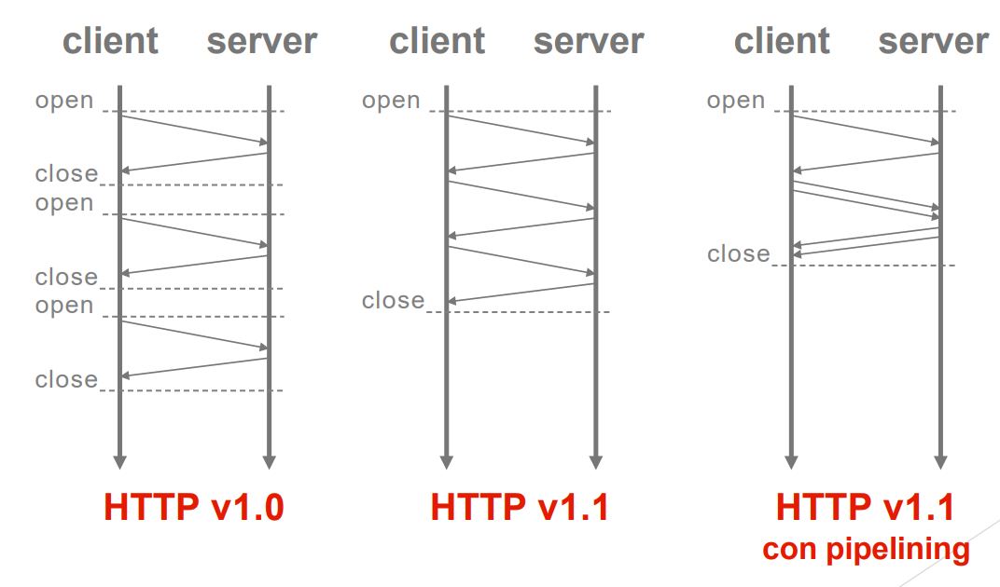

***Hyper Text Transfer Protocol*** è un protocollo di tipo applicativo di tipo stateless (non mantiene uno stato, in quanto né il server né il client mantengono informazioni rilevanti alla richiesta fatta). Viene utilizzato quindi per trasferire le risorse dal Web Server al client, gestendo sia richieste che risposte.

Terminologia:
- **client**: programma applicativo che stabilisce la connessione per richieste HTTP
- **server**: accetta le connessione HTTP per gestire ed elaborare le richieste del client
- **connessione**: circuito virtuale stabilito tra due applicazioni per fini comunicativi
- **messaggio**: unità base della comunicazione HTTP, una specifica sequenza di byte concettualmente atomica (request e response)
- **resource**: oggetto univocamente definito
- **URI**: *Uniform Resource Identifier*, identificatore unico per una risorsa
- **entity**: rappresentazione di un messaggio
## HTTP nello stack TCP/IP
Tale stack ha diversi livelli (dal più basso al più alto):
- **network access level**: rete di base (protocollo ethernet, 5G)
- **internet layer**: indirizzi IP
- **transport layer**: TCP
- **application layer**: protocollo HTTP, DNS
## HTTP v.1.0
Viene pubblicato nel 1996, è un protocollo _request-response_, _stateless_ e _one shot_: dopo che la richiesta è stata inviata, viene chiusa. Per ogni richiesta verrà quindi creata una nuova connessione. Tali richieste vengono soddisfatte attraverso il protocollo TCP.

 > **Esempio:**
 > - Il client http inizia una connessione attraverso il server http sulla porta 80
 > - Il server accetta la richiesta di connessione ne dà conferma al client
 > - Il client invia un _request message_ contenente un URL
 > - Il server riceve il messaggio, costruisce il _response message_ contenente il contenuto richiesto, lo invia e chiude la connessione
 > - Il client riceve il messaggio di risposta contente il file html, visualizzando la pagina, mentre il server chiude la connessione TCP. Il browser trova altri 10 riferimenti ad oggetti JPEG, quindi ci sarà bisogno di ripetere questi passaggi per altre 10 volte
 
Grazie alla v.1.1 (1997) si è data la possibilità di specificare una serie multipla di richieste/risposte in un'unica connessione. In questo modo, le connessioni della 1.0 sono dette **non persistenti**, mentre quelle della 1.1 vengono dette **persistenti**. Il server lascerà aperta la connessione fino a che il client non la chiude o comunque quando, dopo un periodo di time out, non arrivano ulteriori richieste dal client.

---
L'invio di molteplici richieste da parte del client e la ricezione di queste risposte da parte del server viene chiamata **operazione di *pipelining***:

L'ordine delle richieste è importante, in quanto c'è bisogno di non confonderne il contenuto.
## HTTP/2
**Obiettivi:** miglioramento complessivo delle performance mantenendo la compatibilità totale con il protocollo precedentemente in utilizzo (possibilità di utilizzare quello che già è presente aggiungendone delle funzionalità). Ridurre quindi i tempi di caricamento e aumento dell'efficienza delle richieste:
- ***request-response multiplexing:*** l'invio e la ricezione di richieste multiple non avvengono in ordine, quindi le richieste di invio e ricezione possono avvenire in maniera sincrona
- ***header compression:*** i pacchetti inviati vengono ridimensionati con questo aggiornamento, che permette di non ripetere questo tipo di identificatore
- ***server push:*** il server può inviare informazioni aggiuntive (es. pagina web con più risorse presenti su quest'ultima)
L'HTTP/2 si basa sul protocollo **SPDY**, promosso da Google. Molti dei browser avevano cominciato già a supportarlo prima dell'avvento del nuovo protocollo.
## HTTP/3
**Obiettivo:** miglioramento delle velocità e riduzione della latenza, soprattutto su reti congestionate o inaffidabili.
- Il protocollo di trasporto cambia dal protocollo TCP al protocollo QUIC
- ***stream multiplexing:*** il concetto alla base è sempre quello di inviare e ricevere risorse in maniera sincrona
- controllo di flusso per-stream
- realizzazione di connessioni con bassissima latenza

 > **Latenza**
 > La latenza è definita come il **tempo di ritardo tra la ricezione della richiesta e l'invio delle risorse** richieste, ed è fortemente influenzata da una molteplicità di fattori:
 > - **distanza fisica** tra client e server
 > - **congestione della rete** (una rete sovraccarica può causare ritardi nei tempi di risposta, anche a livello mondiale)
 > - **qualità della connessione** (stabilità della connessione, connessione mobile ecc.)
 > - **tipo di protocollo** (alcuni protocolli, come il QUIC rispetto al TCP, richiede meno passaggi per stabilire e mantenere la connessione, e quindi la velocizzano)
## Messaggi HTTP
Ogni messaggio HTTP è costituito da due parti:
- **header:** contiene le informazioni necessarie per identificare il messaggio
- **body:** contiene i dati trasportati dal messaggio
I dati sono codificati secondo una codifica contenuta nell'header, solitamente in formato MIME.
Gli header sono solitamente costituiti da coppie nome-valore che specificano le caratteristiche del messaggio inviato o ricevuto:
- header generali della trasmissione
- header relativi all'entità trasmessa
- header riguardo la richiesta effettuata
- header della risposta generata
##### Esempio di richiesta

- Il body non è presente nelle operazioni di GET
##### Esempio più complesso

##### Esempio di risposta

##### Risposta con header e body

## Comandi della richiesta HTTP:
- **GET:** è la richiesta più comune
- **POST:** a differenza della GET, con la POST posso continuare a chiedere una risorsa senza dichiarare i dettagli nell'URL ma nel body. Non ci sono limiti di lunghezza, e si usa solitamente quando il client vuole inserire dei dati in un form HTML
- **PUT**: trasmette la memorizzazione sul server
- **DELETE**: richiesta di cancellazione di dati memorizzati
Questi ultimi due comandi sono solitamente disabilitati su reti pubbliche.
## Codici di stato
Lo status code è un numero di tre cifre, di cui la prima indica la classe della risposta, mentre le altre due la risposta specifica. Sono presenti 5 classi:
- `1xx` **Informazionale**: risposta temporanea alla richiesta durante il suo svolgimento
- `2xx` **Successful**: il server ha ricevuto, capito e accettato la richiesta
- `3xx` **Redirection**: il server ha ricevuto e capito la richiesta, ma sono necessarie ulteriori azioni da parte del client per portare a termine la richiesta
- `4xx` **Client error**: la richiesta del client non può essere soddisfatta per un errore da parte del client (sintattico o una richiesta non autorizzata)
- `5xx` **Server error**: la richiesta del client può essere corretta, ma il server non è attualmente in grado di soddisfarla per un problema interno
Uno degli esempi è il codice 404.
Il REST è un'architettura che implementa e traduce tutte le richieste client server attraverso l'HTTP.
## I cookie
Sono una struttura dati gestita come un token, va dal server al client e viceversa, e hanno come scopo il mantenimento di uno stato in un protocollo che, come l'HTTP, è dichiarato *stateless*.
Sono sostanzialmente una collezione di stringhe:
- **key**: identifica il cookie all'interno di un `dominio:path`
- **value**: valore associato al cookie (stringa di massimo 255 caratteri)
- **path**: posizione nell'albero di un sito al quale è associato
- **domain**: dominio di generazione
- **max-age** : opzionale, numero di secondi di vita. Permette la scadenza di una sessione
- **secure**: opzionale anche questo, vengono trasferiti solo in un protocollo sicuro come l'HTTPS
- **version**: indica la versione del protocollo di gestione dei cookie

Un altro aspetto molto importante nella comunicazione HTTP è l'**autenticazione**, così da poter restringere l'accesso ad alcune risorse solo ad utenti abilitati. Le tecniche di filtro sono:
- filtro su set di indirizzi IP: non funziona se l'IP è dinamico o privato. Inoltre è possibile camuffare il proprio IP per accedere lo stesso, quindi non viene molto usato
- form per la richiesta di username e password
- HTTP BASIC
- HTTP DIGEST (caduto in disuso)
I restanti due tipi di filtro quindi sono quelli solitamente più usati:
#### HTTP Basic
1. Challenge da parte del server
2. Successiva request da parte del client con username (in chiaro) e password (codificato)
## Sicurezza delle connessioni
Quando si parla di sicurezza si parla di proprietà desiderabili:
- **confidenzialità** (solo chi è autorizzato dovrebbe vedere le informazioni a cui accede)
- **integrità** (i dati mandati non devono essere corrotti in alcun modo)
- **autenticità** (i dati mandati devono essere oggettivamente veri)
- **non ripudio** (non viene solitamente implementata dal protocollo socket layer, ma è la non negazione da parte di una delle due parti della ricezione del messaggio)
La sicurezza viene quindi implementata con il ***Secure Sockets Layer*** e il ***Transport Layer Security*** (questo è alla base dell'HTTPS)
La crittografia è basata su un sistema asimmetrico, con una chiave pubblica e privata (una per criptare i dati e l'altra per decriptarli), e un certificato che garantisce l'autenticità del server.
## Caching
L'idea di base è memorizzare copie temporanee di documenti web al fine di ridurre l'uso di banda ed il carico sul server. Una Web cache memorizza i documenti che la attraversano. L'obiettivo è usare i documenti in cache per le successive richieste qualora alcune condizioni siano rispettate. Ne esistono di due tipi:
- ***User agent cache***: memorizza le pagine visitate dall'utente. Veniva usata spesso sui dispositivi mobili, grazie alla quale nei momenti di non disponibilità di una connessione si riesce a lavorare lo stesso
- ***Proxy cache***: un proxy che sulla traiettoria client/server memorizza e ridistribuisce le richieste, così da ridurre le richieste effettuate al server e la necessità di banda. Questo tipo di cache è chiamato *forward proxy cache*, mentre è disponibile anche la *reverse o server-side proxy cache*, che permette di ridurre il carico che arriva al server attraverso dei getaway.