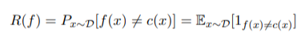

 > *Lezione del 25/02/2025*
 
Il learning si fa con un modello probabilistico e un dataset. Viene definito come **supervisionato** perché la parte di labelling e assegnazione dei dati e del dataset è fatta a mano da un umano.
Concettualmente, un **insieme di dati** è un insieme di caratteristiche (*feature*) che hanno i dati stessi.
L'obiettivo non è sapere tutte le regole che ci portano a prendere una determinata decisione come la classica programmazione, ma che il modello probabilistico le impari e prendi le decisioni al posto nostro.
I dati contenuti all'interno di un insieme dovranno avere delle *label* (solitamente numeriche). Ogni dato va associato a delle feature
**Es.**
 > All'interno di un dataset fatto di figure geometriche, andremo a classificare come:
 > 1. Triangoli
 > 2. Cerchi
 > 3. Quadrati
 > A queste figure labellati andremo ad assegnare delle feature come area, numero di lati, ecc.

Per fare il learning avremo due fasi alternate:
1. **Fase di training**: impara un modello usando dati d'allenamento
2. **Fase di testing**: testa il modello con dati non utilizzati per assicurare l'accuratezza del modello, calcolata come:
##### Training pipeline

L'**ottimizzatore** permette di andare a modificare la funzione del modello di learning nei suoi parametri in base alla *loss* (valutazione della differenza tra dati assegnati e risultati). Il ciclo rappresentato viene fermato nel momento in cui abbiamo l'accuratezza desiderata.
##### Inference pipeline
Il nostro obiettivo è ovviamente avere un modello che sappia lavorare con dataset diversi da quello di training. Per fare questo si tiene un insieme di dati reali e si va a fare ***inference***:

#### Assunzione i.i.d.
La differenza in performance tra il dataset di allenamento e quello di test è definito come **generalization gap** e vorrei che fosse il più basso possibile.
Il learning è quindi possibile solo se i dati di training e quelli di testing hanno **la stessa distribuzione**, quindi i dati all'interno di un dataset dovranno essere ***i.i.d.*** (*indipendenti e identicamente distribuiti*). Nella teoria si prenderebbero dei dati presenti all'interno di quelli di training, ma nella pratica questa cosa non è possibile. Per avere gap quasi pari a zero, bisognerebbe quindi mantenere il più simili possibili i dati di training e test.
Ovviamente più tale assunzione viene violata, più il sistema non funziona.
Teoricamente, data una funzione di classificazione *f*, e una distribuzione dei dati *D*, il **rischio** della funzione di classificazione è descritto come segue:

Il ***rischio empirico*** si calcola, dato un set di elementi *m*, in questo modo:

(si mette uno se la stima converge con il dato che ci aspettiamo in output, zero altrimenti)

#### Classificazione di un modello
Il modello probabilistico si classifica attraverso:
- **accuratezza** (formula descritta precedentemente)
- **efficienza**: tempo di calcolo e costruzione del modello
- **robustezza**: gestione del rumore nelle feature, label e valori mancanti ecc.
- **scalabilità**
- **interpretabilità**
- **compattezza del modello**: numero di regole e grandezza dell'albero decisionale
Il set utilizzato per la costruzione del modello è diviso in:
- **training set**: usato per cambiare i parametri del modello
- **test set**: per testare il modello (non viene mai toccato e cambiato). Viene anche chiamato ***holdout set*** in quanto tenuto da parte rispetto al dataset originale
Le performance vengono ovviamente calcolate sul test set.
## Iperparametri
Sono parametri che descrivono il modello e il processo di training dello stesso (per quanto tempo è stato allenato, la grandezza, costanti di regolarizzazione, architettura dell'eventuale rete neurale, inizializzazione degli iperparametri, grandezza del set di testing ecc.). Tali parametri non possono essere imparati ma devono essere decisi personalmente, in base alla nostra esperienza nel campo.
Sono molto impattanti sotto il punto di vista dell'accuracy. Per stimare gli iperparametri viene aggiunta un'ulteriore partizione nel dataset originale chiamato **validation set**.
1. I modelli vengono addestrati sul modello di training con un set di iperparametri a scelta
2. Viene valutato l'errore sul validation set
3. Il set di iperparametri che ha il valore di errore minimo viene selezionato e riallenato sul training set
4. Per verificare l'accuratezza testeremo il modello sull'holdout set
Quando il dataset è molto piccolo, tuttavia, si può provare ad approssimare attraverso un metodo euristico chiamato **k-fold crossvalidation**:
1. Il dataset viene partizionato in maniera randomica in *K* partizioni
2. Faccio training su tutti i gruppi meno uno; testo sull'unico rimasto
3. Tale procedura viene ripetuta *K* volte (una partizione viene mantenuta fuori ad ogni iterazione)
4. L'accuracy sarà la media dell'accuratezza calcolata per ogni iterazione
5. Se siamo contenti dell'accuracy ottenuta, allora faccio il training del modello sul dataset nella sua interezza
Su dataset molto molto piccoli viene utilizzata anche la tecnica del **leave one out** (si lascia fuori un dato solo e si fa training sugli altri, una volta per ogni elemento del dataset).
## Misure di classificazione
L'accuracy non è ovviamente l'unica misura di classificazione di un sistema, in quanto non può essere applicata ad alcuni sistemi (ad esempio, in presenza di **dati sbilanciati**. Più il dataset è sbilanciato, meno l'accuracy avrà valore in termini di classificazione, in quanto sarà sempre presente una classe predominante nel dataset.). In casi di dataset sbilanciati, l'evento rispetto alla grande quantità e solitamente presente in minor numero si chiama **classe positiva**.
Definiamo **vero positivo** se il modello dice che l'evento c'è, e in realtà c'è; **falso positivo** se il modello dice che c'è ma in realtà non c'è; **falso negativo** se dice che non c'è ma in realtà c'era
Le altre metriche utilizzate sono **precision** e **recall**.
##### Precision
E' la percentuale di fiducia nel modello nel momento in cui il risultato è un positivo.
$$p=\frac{TP}{TP+FP}$$
Un sistemo con un'alta precisione non vuol dire che funzioni. Tale misura va in coppia quindi con la **recall**, la quale ci dice qual è la percentuale di copertura degli eventi positivi.
##### Recall
$$r=\frac{TP}{TP+FN}$$
Tali misure in qualche modo tirano da parti opposte (più è alta una, più si abbasserà l'altra). SI mettono insieme in una misura chiamata **F1-score** (media armonica tra i due valori):
$$\frac{1}{F1}=\frac{1}{p}+\frac{1}{r}$$
---
 >*Lezione del 04/03/2025*

[ROC curve]
Per misurare la distanza o la similitudine tra due distribuzioni di probabilità esistono due misurazioni:
-  coefficiente di Bhattacharrya (misura la sovrapposizione tra le due distribuzioni)
$$\int_{x}P\left(x\right)Q\left(x\right)$$
- divergenza KL: misura quanta informazione perdiamo quando la distribuzione Q viene usata come approssimazione della distribuzione P
#### Cross entropy
$$H\left(P,Q\right)=$$
Tiene conto di quanto è complicata l'approssimazione e di quanto effettivamente l'approssimazione copra tutti i dati.
Grazie a tale formula, possiamo reimmaginare il nostro classificazione in questo modo:
[Cross entropy 2 di un classificatore rispetto ad un dataset]
Il nostro obiettivo sarà quindi creare un modello che approssimi nel miglior modo possibile P(x) attraverso Q(x). 
Nel caso le informazioni date siano binarie, posso riscrivere la formula della cross entropy in questo modo:
[Binary case]
